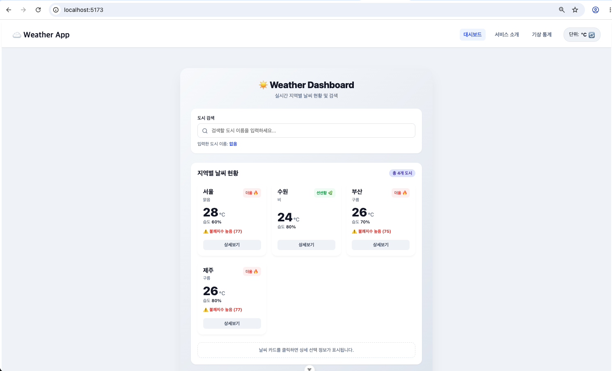

# skala-vue

# 0811 Vue.js 과제

- **제출일**: 2026년 8월 11일

## 과제 1: WeatherMockup

두 가지 버전으로 작업했습니다. 아래 링크에서 확인하실 수 있습니다.

1. **CSS 적용 버전**: [src/components/mockup/WeatherMockup.vue](src/components/mockup/WeatherMockup.vue)
   <br>
   
2. **CSS 미적용 버전**: [src/components/mockup/WeatherMockupNoCSS.vue](src/components/mockup/WeatherMockupNoCSS.vue)

---

## 과제 2: WeatherComposition

두 가지 버전으로 작업했습니다. 아래 링크에서 확인하실 수 있습니다.

1. **CSS 적용 버전**: [src/components/weathercomposition/WeatherComposition.vue](src/components/weathercomposition/WeatherComposition.vue)
   <br>
   
2. **CSS 미적용 버전**: [src/components/weathercomposition/WeatherCompositionNoCSS.vue](src/components/weathercomposition/WeatherCompositionNoCSS.vue)

---

## 과제 3: Weather Component (컴포넌트 분리)

컴포넌트를 여러 개로 분리하여 작업했습니다. 메인 진입점은 `WeatherParent.vue`입니다. 아래 링크에서 확인하실 수 있습니다.

- **메인 컴포넌트**: [src/components/ weathercomponent/WeatherParent.vue](src/components/%20weathercomponent/WeatherParent.vue)
- **하위 컴포넌트**:
  - [src/components/ weathercomponent/WeatherCard.vue](src/components/%20weathercomponent/WeatherCard.vue)
  - [src/components/ weathercomponent/SearchBar.vue](src/components/%20weathercomponent/SearchBar.vue)
  - [src/components/ weathercomponent/BaseDashboardCard.vue](src/components/%20weathercomponent/BaseDashboardCard.vue)
  - [src/components/ weathercomponent/SelectionFeedback.vue](src/components/%20weathercomponent/SelectionFeedback.vue)


---

## 과제 4: Weather Router (Vue Router 적용)

Vue Router를 도입하여 SPA(Single Page Application)로 구현했습니다. 주요 라우팅 및 뷰(View) 파일은 아래와 같습니다.

- **라우터 설정**: [src/router/index.js](src/router/index.js)
- **메인 레이아웃**: [src/App.vue](src/App.vue)
- **Views (페이지)**:
  - 대시보드 (Home): [src/views/WeatherHomeView.vue](src/views/WeatherHomeView.vue)
  - 서비스 소개 (About): [src/views/WeatherAboutView.vue](src/views/WeatherAboutView.vue)
  - 상세 날씨 (Detail): [src/views/WeatherDetailView.vue](src/views/WeatherDetailView.vue)
  - 기상 통계 (Stats): [src/views/WeatherStatsView.vue](src/views/WeatherStatsView.vue)
  - 404 에러 (NotFound): [src/views/NotFoundView.vue](src/views/NotFoundView.vue)


---

## 과제 5: Weather Store (Pinia 적용)

Pinia를 도입하여 전역 상태 관리를 구현했습니다. 온도 단위(섭씨/화씨)와 관련된 상태와 변환 로직을 스토어에 캡슐화하여 코드 중복을 제거했습니다.

- **스토어 파일**: [src/stores/configStore.js](src/stores/configStore.js)
- **주요 기능**:
  - `unit` (State): 현재 설정된 온도 단위 (celsius/fahrenheit)
  - `unitSymbol` (Getter): 화면에 표시할 기호 반환 (°C / °F)
  - `toggleUnit` (Action): 단위를 상호 전환하는 함수
  - `convertTemp` (Action): 섭씨 원본 데이터를 현재 단위에 맞춰 변환하는 함수
- **적용 화면**: 상단 네비게이션 바의 단위 변경 버튼(`UnitToggler.vue`) 클릭 시 메인 대시보드, 상세 날씨, 기상 통계 등 앱 전체에 단위가 일괄 적용됩니다.
  

---

## 과제 6: OpenWeatherMap API 연동 및 데이터 상태 관리

기존에 사용하던 가짜(Mock) 데이터를 실제 OpenWeatherMap API 데이터로 대체하고, Pinia를 활용해 중앙 집중식으로 데이터를 관리하도록 개선했습니다.

- **API 호출 (Axios)**: [src/api/weatherApi.js](src/api/weatherApi.js)
  - `fetchWeatherByCity`: 전국 주요 8개 도시의 현재 날씨(온도, 습도, 풍속 등) 조회
  - `fetchAirPollution`: 반환받은 위경도를 이용해 실시간 대기질(미세먼지) 지수 추가 조회
- **날씨 전역 스토어**: [src/stores/weatherStore.js](src/stores/weatherStore.js)
  - 앱 구동 시 API를 최초 1회만 호출하여 데이터를 캐싱(`fetchAllWeather`).
  - 온도와 습도를 이용한 **불쾌지수 자동 계산**, 일출/일몰 시간 변환 등 데이터 가공을 스토어에서 일괄 처리.
- **적용 화면 (완벽 동기화)**:
  - `WeatherHomeView.vue`: 스토어와 연결하여 실제 지역별 날씨 카드 렌더링.
  - `WeatherDetailView.vue`: 선택 도시의 일출/일몰, 실시간 미세먼지, 풍속 상세 정보 표시.
  - `WeatherStatsView.vue`: 실제 데이터를 바탕으로 전국 평균 기온, 가장 더운 곳, 습도 경고 지역 통계에 더하여 **가장 바람이 강한 지역**과 **미세먼지 청정 구역** 통계를 추가 산출.

---

## 과제 7: UI Library (PrimeVue 3) 연동

오픈소스 UI 라이브러리인 **PrimeVue(버전 3)**를 전역에 연동하고, 프로젝트 기존의 고유한 디자인 톤을 해치지 않도록 `Lara Light Blue` 테마를 적용했습니다.

- **연동 설정 파일**: [src/main.js](src/main.js)
  - PrimeVue 코어 및 전용 CSS 테마 적용
- **적용 컴포넌트**:
  - `UnitToggler.vue`: 온도 단위 변경 버튼에 PrimeVue `<Button>` 적용 (Outlined + 아이콘)
  - `WeatherAboutView.vue`, `WeatherDetailView.vue`: 하단 '대시보드로 돌아가기' 이동 버튼을 깔끔한 PrimeVue `<Button>`으로 교체
- **결과**: 개발자가 직접 작성한 CSS와 외부 라이브러리 컴포넌트가 위화감 없이 어우러지는 하이브리드 UI 구현 완성!

---

## 추가 개선 사항 (UI/UX 및 버그 수정)

앱의 사용성을 높이기 위해 다음과 같은 디테일한 개선을 진행했습니다.

1. **전체 레이아웃 통일**: 상세 페이지와 통계 페이지의 배경 및 컨테이너 위치를 메인 대시보드와 동일한 모던 카드형 레이아웃으로 완벽하게 통일했습니다.
2. **불쾌지수 경고창 중복 버그 수정**: 홈 화면 진입 시 불쾌지수가 높은 지역이 여러 개일 경우 경고창(Alert)이 여러 번 연속해서 뜨는 불편한 UX를 수정하여, 사용자 피로도를 낮추었습니다.
3. **통계 데이터 빈 상태(Empty State) 처리**: 기상 통계 페이지에서 '습도 70% 이상인 지역'이나 '미세먼지 좋음 지역'이 하나도 없을 경우, 빈 화면이 아닌 "해당하는 지역이 없습니다"라는 친절한 안내 메시지가 나오도록 처리했습니다.

---

### 실행 방법

```sh
npm install
npm run dev
```
