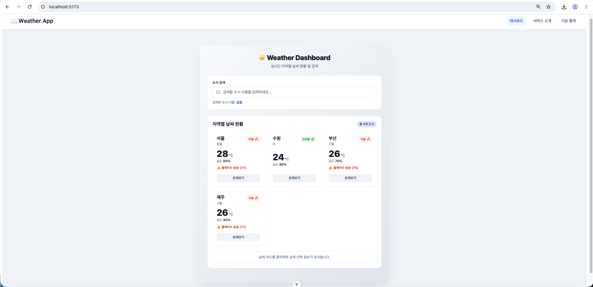

# skala-vue

# 0811 Vue.js 과제

- **제출일**: 2026년 8월 11일

## 과제 1: WeatherMockup

두 가지 버전으로 작업했습니다. 아래 링크에서 확인하실 수 있습니다.

1. **CSS 적용 버전**: [src/components/mockup/WeatherMockup.vue](src/components/mockup/WeatherMockup.vue)
   <br>
   
2. **CSS 미적용 버전**: [src/components/mockup/WeatherMockupNoCSS.vue](src/components/mockup/WeatherMockupNoCSS.vue)

---

## 과제 2: WeatherComposition

두 가지 버전으로 작업했습니다. 아래 링크에서 확인하실 수 있습니다.

1. **CSS 적용 버전**: [src/components/weathercomposition/WeatherComposition.vue](src/components/weathercomposition/WeatherComposition.vue)
   <br>
   
2. **CSS 미적용 버전**: [src/components/weathercomposition/WeatherCompositionNoCSS.vue](src/components/weathercomposition/WeatherCompositionNoCSS.vue)

---

## 과제 3: Weather Component (컴포넌트 분리)

컴포넌트를 여러 개로 분리하여 작업했습니다. 메인 진입점은 `WeatherParent.vue`입니다. 아래 링크에서 확인하실 수 있습니다.

- **메인 컴포넌트**: [src/components/ weathercomponent/WeatherParent.vue](src/components/%20weathercomponent/WeatherParent.vue)
- **하위 컴포넌트**:
  - [src/components/ weathercomponent/WeatherCard.vue](src/components/%20weathercomponent/WeatherCard.vue)
  - [src/components/ weathercomponent/SearchBar.vue](src/components/%20weathercomponent/SearchBar.vue)
  - [src/components/ weathercomponent/BaseDashboardCard.vue](src/components/%20weathercomponent/BaseDashboardCard.vue)
  - [src/components/ weathercomponent/SelectionFeedback.vue](src/components/%20weathercomponent/SelectionFeedback.vue)


---

## 과제 4: Weather Router (Vue Router 적용)

Vue Router를 도입하여 SPA(Single Page Application)로 구현했습니다. 주요 라우팅 및 뷰(View) 파일은 아래와 같습니다.

- **라우터 설정**: [src/router/index.js](src/router/index.js)
- **메인 레이아웃**: [src/App.vue](src/App.vue)
- **Views (페이지)**:
  - 대시보드 (Home): [src/views/WeatherHomeView.vue](src/views/WeatherHomeView.vue)
  - 서비스 소개 (About): [src/views/WeatherAboutView.vue](src/views/WeatherAboutView.vue)
  - 상세 날씨 (Detail): [src/views/WeatherDetailView.vue](src/views/WeatherDetailView.vue)
  - 기상 통계 (Stats): [src/views/WeatherStatsView.vue](src/views/WeatherStatsView.vue)
  - 404 에러 (NotFound): [src/views/NotFoundView.vue](src/views/NotFoundView.vue)



---

### 실행 방법
```sh
npm install
npm run dev
```
