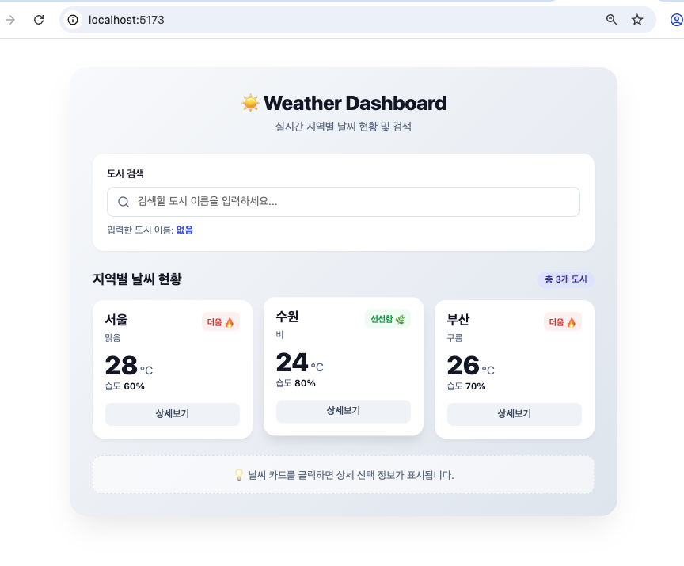
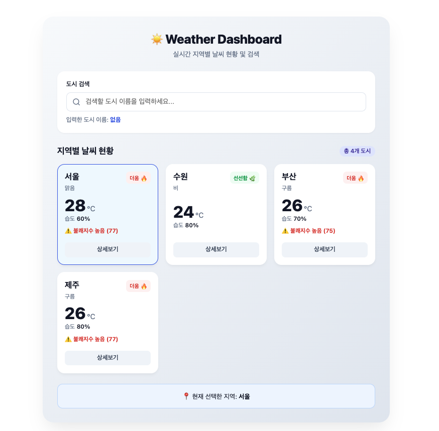

# skala-vue

# 0811 Vue.js 과제

- **제출일**: 2026년 8월 11일

## 과제 1: WeatherMockup

두 가지 버전으로 작업했습니다. 아래 링크에서 확인하실 수 있습니다.

1. **CSS 적용 버전**: [src/components/mockup/WeatherMockup.vue](src/components/mockup/WeatherMockup.vue)
   <br>
   
2. **CSS 미적용 버전**: [src/components/mockup/WeatherMockupNoCSS.vue](src/components/mockup/WeatherMockupNoCSS.vue)

---

## 과제 2: WeatherComposition

두 가지 버전으로 작업했습니다. 아래 링크에서 확인하실 수 있습니다.

1. **CSS 적용 버전**: [src/components/weathercomposition/WeatherComposition.vue](src/components/weathercomposition/WeatherComposition.vue)
   <br>
   
2. **CSS 미적용 버전**: [src/components/weathercomposition/WeatherCompositionNoCSS.vue](src/components/weathercomposition/WeatherCompositionNoCSS.vue)

---

## 과제 3: Weather Component (컴포넌트 분리)

컴포넌트를 여러 개로 분리하여 작업했습니다. 메인 진입점은 `WeatherParent.vue`입니다. 아래 링크에서 확인하실 수 있습니다.

- **메인 컴포넌트**: [src/components/ weathercomponent/WeatherParent.vue](src/components/%20weathercomponent/WeatherParent.vue)
- **하위 컴포넌트**:
  - [src/components/ weathercomponent/WeatherCard.vue](src/components/%20weathercomponent/WeatherCard.vue)
  - [src/components/ weathercomponent/SearchBar.vue](src/components/%20weathercomponent/SearchBar.vue)
  - [src/components/ weathercomponent/BaseDashboardCard.vue](src/components/%20weathercomponent/BaseDashboardCard.vue)
  - [src/components/ weathercomponent/SelectionFeedback.vue](src/components/%20weathercomponent/SelectionFeedback.vue)
   <br>
   

---

### 실행 방법
```sh
npm install
npm run dev
```
